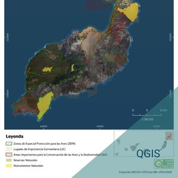
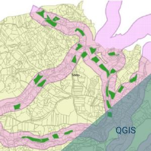
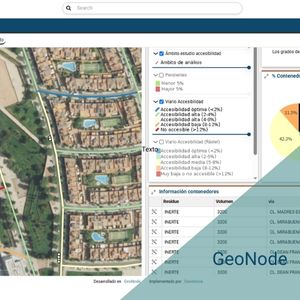

# 🗺️ Mis Proyectos SIG

Aquí puedes ver algunos de mis proyectos de análisis espacial y cartografía.

## Proyecto 1: Espacios Naturales de Lanzarote

📌 [Ver más detalles](proyectos/proyecto1)

## Proyecto 2: Análisis de Ubiación de Centro de Gestión de residuos

📌 [Ver más detalles](proyectos/proyecto2)

## Proyecto 3: Portal de datos con GeoNode

📌 [Ver más detalles](proyectos/proyecto3)
