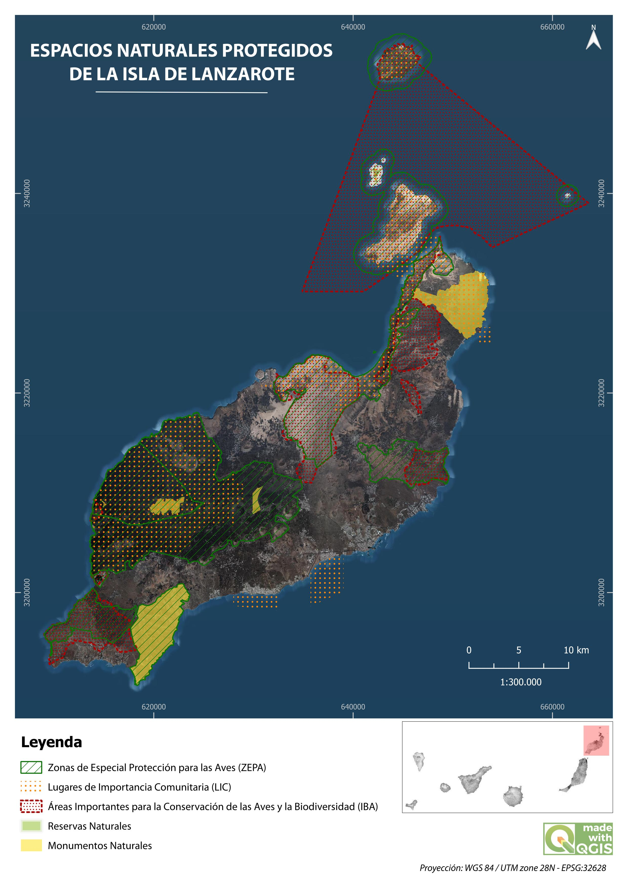

# 🌍 Proyecto 1: Espacios naturales de Lanzarote

📌 **Descripción**  
Como parte de una práctica introductoria en cartografía SIG, se propuso representar las principales figuras de protección ambiental en Lanzarote mediante un mapa temático claro y funcional.

🛠 **Tecnologías usadas**  
- QGIS

⚙️**Proceso técnico**
Se trabajó con capas vectoriales categorizadas por tipo de protección, aplicando simbología, etiquetas y elementos gráficos esenciales en el diseñador de impresión de QGIS.

📈 **Resultado**
Mapa final exportado en formato A4, visualmente claro y adecuado para tareas educativas y de divulgación ambiental.

🗺️ **Mapa del análisis**  

