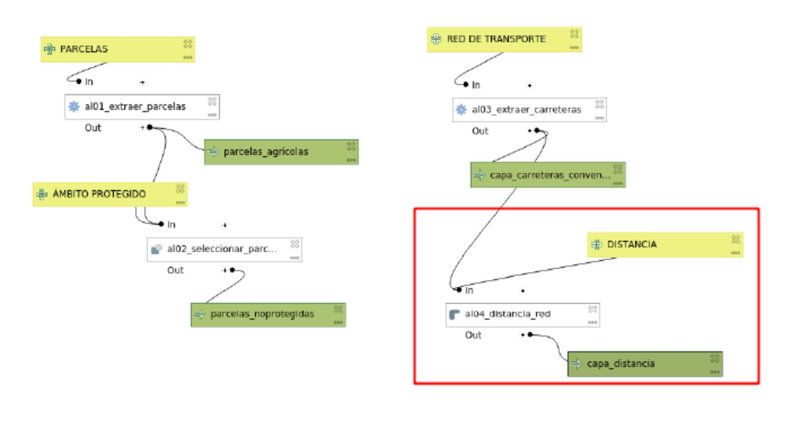
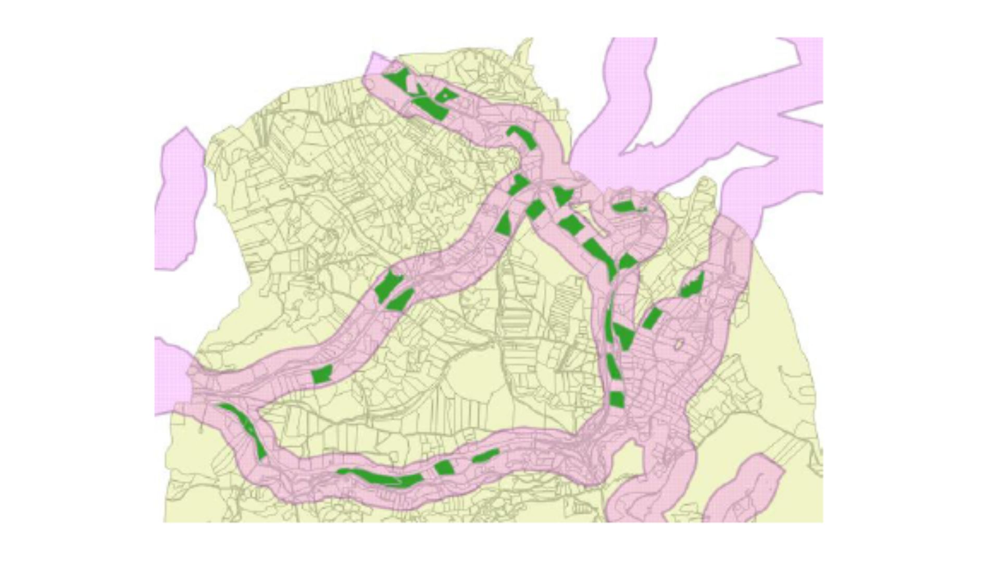

# 🌍 Proyecto 2: Análisis de ubicación de centro de Gestión de residuos

📌 **Descripción**  
En esta práctica del módulo avanzado se planteó localizar parcelas agrícolas óptimas para instalar un centro de residuos, considerando tamaño, pendiente, accesibilidad y restricciones legales.

🛠 **Tecnologías usadas**  
- QGIS

⚙️**Proceso técnico**
Se creó un modelo gráfico en QGIS que filtraba parcelas por uso, superficie y localización fuera de espacios protegidos. Posteriormente se aplicó un buffer de 300 m sobre carreteras principales y se calculó la pendiente media por parcela con un MDE. El modelo fue parametrizado para ajustar valores clave como distancia o umbral de pendiente.

📈 **Resultado**
Se generó una capa final con ubicaciones viables. El flujo diseñado es reutilizable y facilita la toma de decisiones basadas en datos geográficos.

🗺️ **Imágenes del proyecto**  

