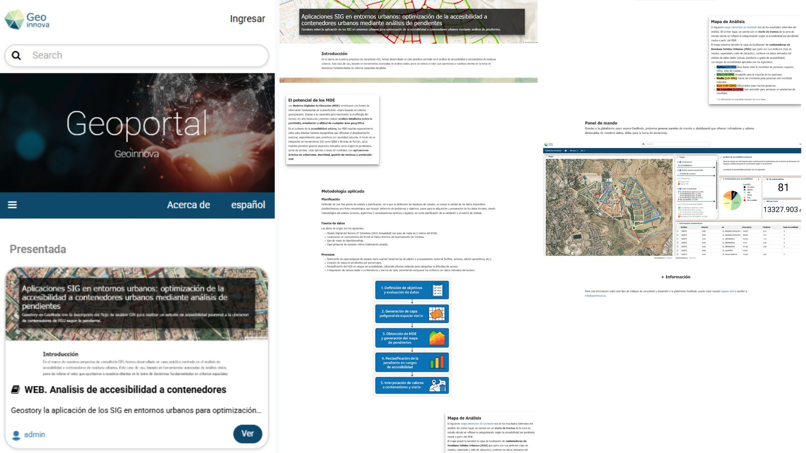
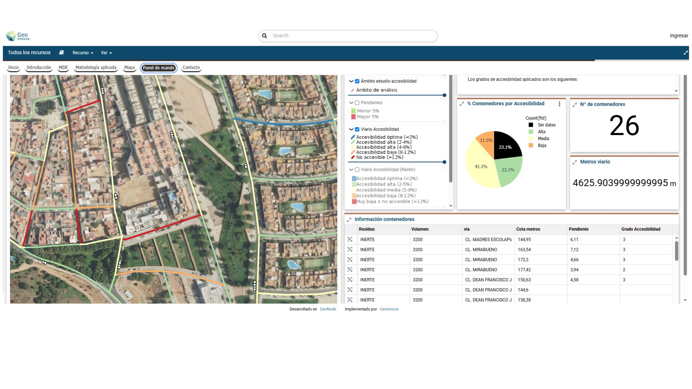

# 🌍 Proyecto 3: Portal de datos espaciales con GeoNode

📌 **Descripción**  
Se propuso implementar un portal web para publicar y gestionar datos espaciales utilizando GeoNode, simulando un entorno institucional accesible y colaborativo.

🛠 **Tecnologías usadas**  
- GeoNode

⚙️**Proceso técnico**
Se instaló GeoNode, se cargaron capas vectoriales y ráster con metadatos, se configuraron visores web y permisos, y se activó la navegación temática para la consulta pública.

📈 **Resultado**
El portal quedó operativo, accesible desde navegador, y preparado para explorar, documentar y compartir información geográfica en contextos educativos o técnicos.

🗺️ **Imágenes del proyecto**  

